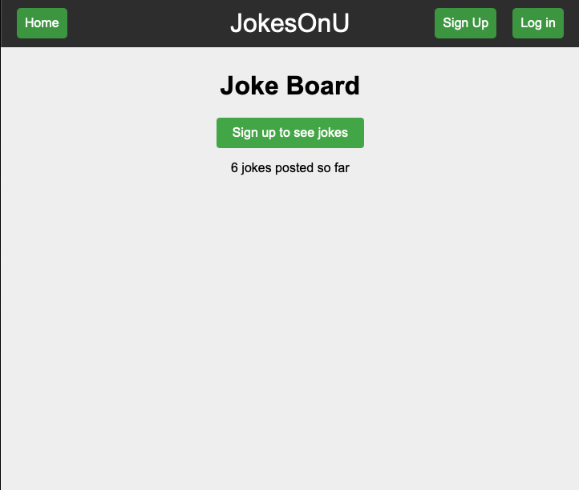
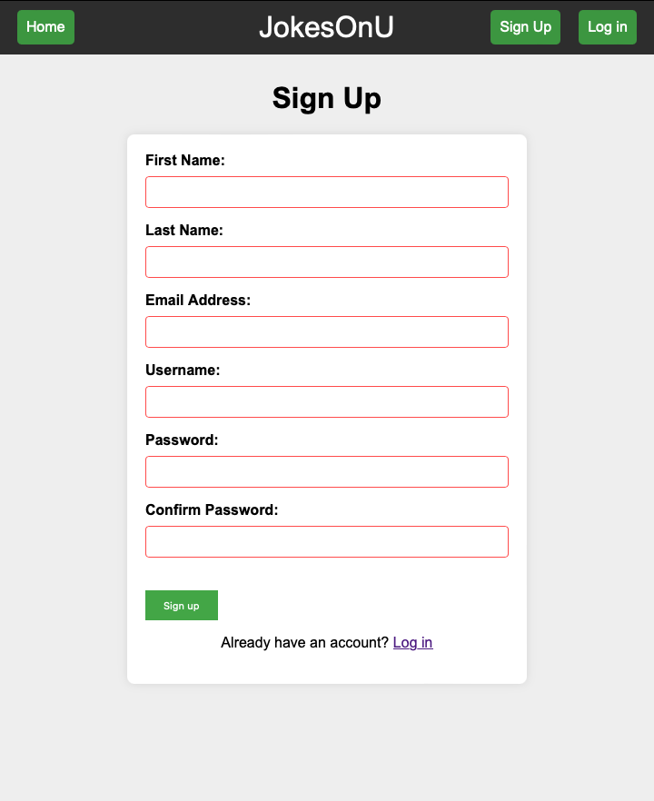
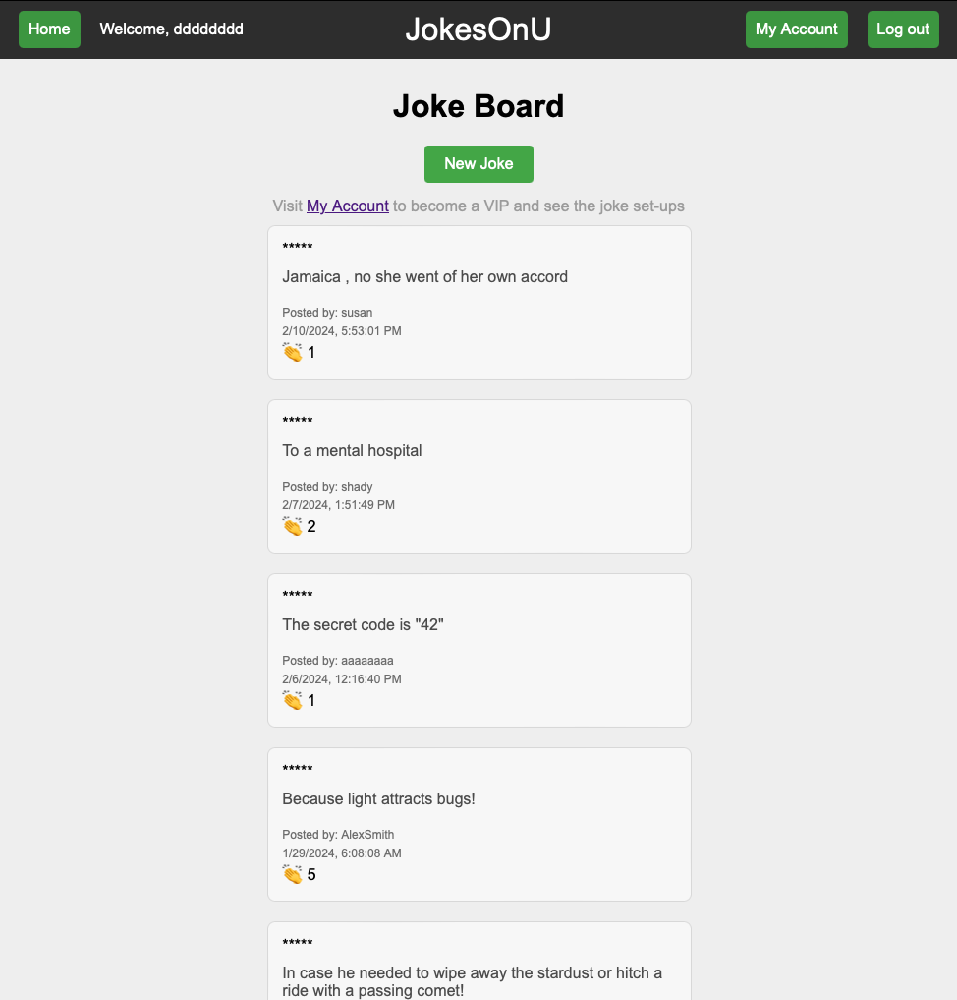
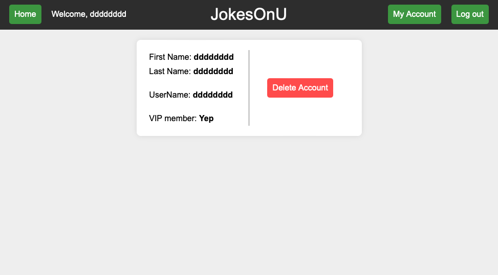

# Jokes-on-U

---

## About this project

This is the members only project assigned by The Odin Project.
This will be my first fully independent express app built with any sort of basic function.
The focus of teh project was to nail down and implememnt everythign I had leart about express so far, with a focus on using PassportJS to authenticate users.

---

## Technologies used

-NodeJS
 
-Express
 
-MongoDB

---

## Screenshots

### Picture 1

### Picture 2

### Picture 3

### Picture 4

